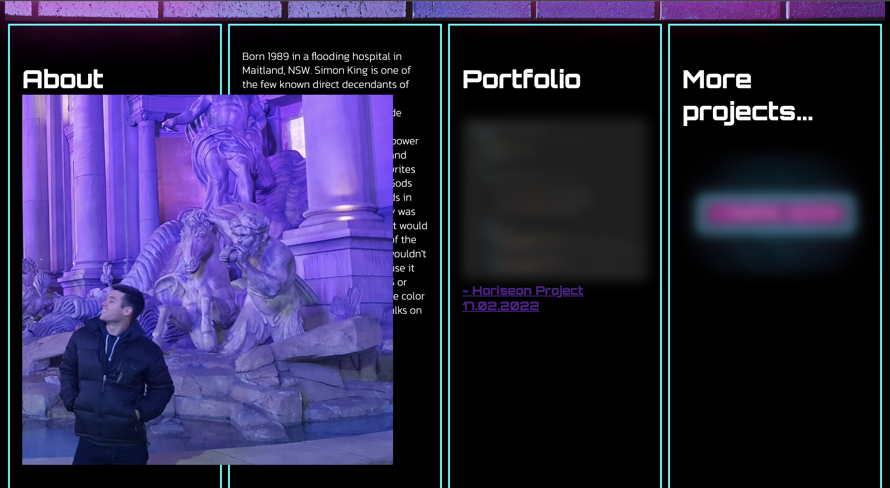

# UWA Week 02 Homework

# Simon-s-Technicolour-Dreamsite Portfolio site
> **The second homework assignment for the UWA coding bootcamp was to create and style a website showcasing my personal portfolio as well as providing information about myself and contact links/links to previous works.**

*Website initial view*

*Portfolio/About hover properties*

*More hover properties*

*Links hover properties*

*Navigation bar preview*

>**The final result can be found at the following URL: https://lev8947.github.io/Simon-s-Technicolour-Dreamcoat/**
